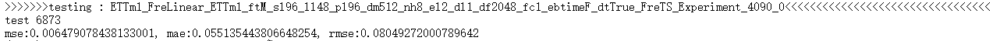
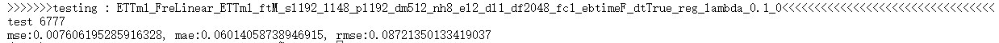
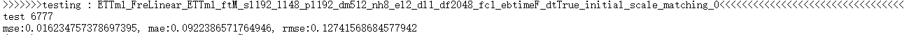
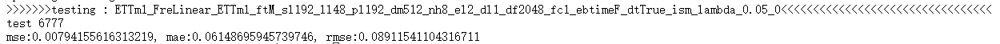
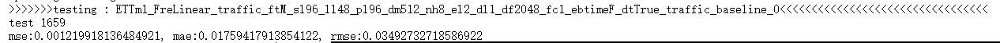
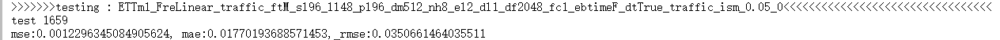
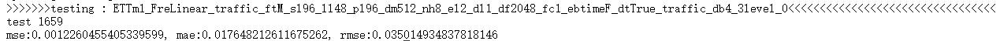
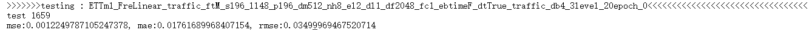
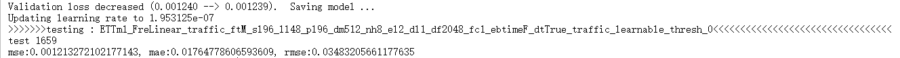

### 1. 针对输入、输出序列长度为96的情况，命令如下：
python run_longExp.py --model FreLinear --data ETTm1 --seq_len 96 --pred_len 96 --batch_size 128 --num_workers 8 --use_gpu True --gpu 0 --train_epochs 20 --patience 5  --des "reg" --reg_lambda 0.01 --wavelet haar
与FreTS模型的效果基本一致

### 2. 针对输入、输出序列长度为192的情况，命令如下：
python run_longExp.py --model FreLinear --data ETTm1 --seq_len 192 --pred_len 192 --batch_size 128 --num_workers 8 --use_gpu True --gpu 0 --train_epochs 20 --patience 5 --reg_lambda 0.1 --des "reg_lambda_0.1"
在正则化系数为0.1时，与FreTS模型的效果基本一致

### 3. 针对输入、输出序列长度为192的情况，命令如下：
python run_longExp.py --model FreLinear --data ETTm1 --seq_len 192 --pred_len 192 --batch_size 128 --num_workers 8 --use_gpu True --gpu 0 --train_epochs 20 --patience 5 --reg_lambda 0.5 --des "initial_scale_matching"
效果不太好，与原模型效果差距不小

[Initial Scale Matching] L_time=0.320436, L_high=0.020152, scale_factor=15.9010
这意味着：

scale_factor = 15.9（高频损失被放大了约 16 倍以对齐时域损失）
reg_lambda = 0.5
实际高频权重 = 15.9 × 0.5 ≈ 8.0

也就是说，高频损失对总损失的贡献是 时域损失的 8 倍！这太大了，导致模型为了死扣高频细节而牺牲了主趋势的拟合。

解决方案
使用了 Initial Scale Matching 之后，reg_lambda 的含义变了：

修改前：reg_lambda 需要很大才能让频域有影响
修改后：两者已经对齐，reg_lambda 现在直接代表"高频约束的相对重要性"
所以你应该使用更小的 reg_lambda
### 4. 针对输入、输出序列长度为192的情况，命令如下：
python run_longExp.py --model FreLinear --data ETTm1 --seq_len 192 --pred_len 192 --batch_size 128 --num_workers 8 --use_gpu True --gpu 0 --train_epochs 20 --patience 5 --reg_lambda 0.05 --des "ism_lambda_0.05"
性能确实相较3有提升，但效果还是与FreTS模型有差距

怀疑是因为：
1. ETTm1 是一个"干净"的数据集：该数据已经过精心预处理，噪声很少。频域正则化的主要作用是去噪，但在本就没什么噪声的数据上，它变成了"额外的约束负担"。

2. FreTS 本身已经在频域工作：它的 
FreMLP
 模块已经通过 softshrink 做了频域稀疏化。再加一层小波分解的频域约束，可能造成了"过度正则化"。
接下来验证基线（最重要） 先用 reg_lambda=0.0 跑一次，确认我们的代码改动没有引入其他问题，如果恢复原始性能就更换数据集
### 5. 更换数据集为traffic.csv，命令如下：
① 先跑不带正则化的基线：python run_longExp.py --model FreLinear --data traffic --data_path traffic.csv --enc_in 862 --dec_in 862 --c_out 862 --seq_len 96 --pred_len 96 --batch_size 16 --num_workers 4 --use_gpu True --gpu 0 --train_epochs 10 --patience 3 --reg_lambda 0.0 --des "traffic_baseline"

效果比FreTS好不少，怀疑是sparsity_threshold（自适应稀疏阈值）由固定变成动态的带来的影响
② 再跑带正则化的模型：python run_longExp.py --model FreLinear --data traffic --data_path traffic.csv --enc_in 862 --dec_in 862 --c_out 862 --seq_len 96 --pred_len 96 --batch_size 16 --num_workers 4 --use_gpu True --gpu 0 --train_epochs 10 --patience 3 --reg_lambda 0.05 --des "traffic_ism_0.05"

虽然性能同样比FreTS好，但效果还是和①有差距，频域正则化起了副作用
### 6.现在FrequencyLoss.py已经实现3层小波分解 + db4
新增功能
db4 小波：8 阶滤波器系数，更平滑，适合自然波动信号
3 层分解：产生 cD1, cD2, cD3 三个频带
分频带加权：
cD1 (极高频/噪声): 权重 1.0 → 强约束
cD2 (次高频/细节): 权重 0.5 → 中等约束
cD3 (中频/模式): 权重 0.1 → 弱约束
cA3 (低频/趋势): 不约束
测试命令：
使用 db4 小波 + 3 层分解
python run_longExp.py --model FreLinear --data traffic --data_path traffic.csv --enc_in 862 --dec_in 862 --c_out 862 --seq_len 96 --pred_len 96 --batch_size 16 --num_workers 4 --use_gpu True --gpu 0 --train_epochs 10 --patience 3 --reg_lambda 0.05 --wavelet db4 --des "traffic_db4_3level"

性能虽与5-②相近，但10个epoch后，损失仍在下降，可增加epoch数
命令如下：
python run_longExp.py --model FreLinear --data traffic --data_path traffic.csv --enc_in 862 --dec_in 862 --c_out 862 --seq_len 96 --pred_len 96 --batch_size 16 --num_workers 4 --use_gpu True --gpu 0 --train_epochs 20 --patience 5 --reg_lambda 0.05 --wavelet db4 --des "traffic_db4_3level_20epoch"

提升效果并不大，后续尝试彻底禁用模型内部的 Softshrink (推荐)
在 FreTS.py 中，将阈值强制设为 0（或者移除 softshrink 操作），让所有频率都通过，然后完全依靠 FrequencyLoss 来约束哪些频率该保留。（需要看看高频信号是否有softshrink操作）
6. ✅ 可学习小波稀疏策略已实现！
架构变化
组件	之前	现在
FreTS.py	softshrink 在 FFT 域过滤	已禁用（你注释掉了）
FrequencyLoss.py	MSE 匹配小波系数	可学习软阈值过滤 + MSE 匹配
新增的可学习参数
threshold_cD1 = 0.05  # 极高频（噪声）- 强过滤
threshold_cD2 = 0.02  # 次高频（细节）- 中等过滤
threshold_cD3 = 0.01  # 中频（模式）- 弱过滤
测试命令
python run_longExp.py --model FreLinear --data traffic --data_path traffic.csv --enc_in 862 --dec_in 862 --c_out 862 --seq_len 96 --pred_len 96 --batch_size 16 --num_workers 4 --use_gpu True --gpu 0 --train_epochs 10 --patience 3 --reg_lambda 0.1 --wavelet db4 --des "traffic_learnable_thresh"

#### 结果：mse:0.001213272102177143, mae:0.01764778606593609, rmse:0.03483205661177635
彻底禁用所有频域约束，需要一个纯净的基线来确认频域是否真的有贡献：
#### 禁用 softshrink（已做） + 禁用 FrequencyLoss（reg_lambda=0）
python run_longExp.py --model FreLinear --data traffic --data_path traffic.csv --enc_in 862 --dec_in 862 --c_out 862 --seq_len 96 --pred_len 96 --batch_size 16 --num_workers 4 --use_gpu True --gpu 0 --train_epochs 10 --patience 3 --reg_lambda 0.0 --wavelet db4 --des "traffic_no_freq_constraint"
场景	预期
如果 reg_lambda=0 更差	说明频域约束确实有用，但 FFT 和小波效果相似
如果 reg_lambda=0 一样好	说明频域约束整体没用，性能提升来自其他因素
如果 reg_lambda=0 更好	说明频域约束反而是负担
#### 结果：mse:0.001223857863806188, mae:0.017660848796367645, rmse:0.03498367965221405
### 7. 尝试在ETTm1上使用
1. 纯净基线（禁用 softshrink + 禁用 FrequencyLoss）
python run_longExp.py --model FreLinear --data ETTm1 --seq_len 96 --pred_len 96 --batch_size 128 --num_workers 4 --use_gpu True --gpu 0 --train_epochs 20 --patience 5 --reg_lambda 0.0 --des "ETTh1_no_freq_constraint"
#### 结果：mse:0.006471211090683937, mae:0.05504194274544716, rmse:0.0804438367486（较差于FreTS）
2. 启用可学习小波阈值（禁用 softshrink + 启用 FrequencyLoss）
python run_longExp.py --model FreLinear --data ETTm1 --seq_len 96 --pred_len 96 --batch_size 128 --num_workers 4 --use_gpu True --gpu 0 --train_epochs 20 --patience 5 --reg_lambda 0.1 --wavelet db4 --des "ETTh1_learnable_thresh"
#### 结果：mse:0.0065952688455581665, mae:0.05585318058729172, rmse:0.08121126145124435
参数说明
参数	ETTh1	Traffic
--data	ETTh1	traffic
--enc_in	7（默认）	862
--batch_size	128（通道少，可用更大）	16
### 8. L1 稀疏正则化 v5.0 已实现！

核心变化
对比项	v4.0 (MSE 匹配)	v5.0 (L1 稀疏)
公式	MSE(cD_pred, cD_true)	`
依赖 y_true	✅ 是	❌ 否
对噪声数据	学习噪声	压制噪声
测试命令
ETTm1（噪声数据 - 预期受益）：

python run_longExp.py --model FreLinear --data ETTm1 --seq_len 96 --pred_len 96 --batch_size 128 --num_workers 4 --use_gpu True --gpu 0 --train_epochs 20 --patience 5 --reg_lambda 0.05 --wavelet db4 --des "ETTh1_L1_sparse"
#### 结果：mse:0.007374423090368509, mae:0.06033434718847275, rmse:0.08587446063756943
python run_longExp.py --model FreLinear --data ETTm1 --seq_len 96 --pred_len 96 --batch_size 128 --num_workers 4 --use_gpu True --gpu 0 --train_epochs 20 --patience 5 --reg_lambda 0.005 --wavelet db4 --des "ETTh1_L1_sparse"
#### 结果：mse:0.0064729610458016396, mae:0.055138636380434036, rmse:0.08045471459627151
python run_longExp.py --model FreLinear --data ETTm1 --seq_len 96 --pred_len 96 --batch_size 128 --num_workers 4 --use_gpu True --gpu 0 --train_epochs 20 --patience 5 --reg_lambda 0.005 --wavelet db4 --des "ETTh1_L1_sparse"（将sparsity_threshold重新固定为0.01）
#### 结果：mse:0.0064729610458016396, mae:0.055138636380434036, rmse:0.08045471459627151
Traffic（对比测试）：

python run_longExp.py --model FreLinear --data traffic --data_path traffic.csv --enc_in 862 --dec_in 862 --c_out 862 --seq_len 96 --pred_len 96 --batch_size 16 --num_workers 4 --use_gpu True --gpu 0 --train_epochs 10 --patience 3 --reg_lambda 0.005 --wavelet db4 --des "traffic_L1_sparse"

训练时会看到

[L1 Sparsity Regularization] wavelet=db4, levels=3
  Detail weights: cD1=1.0, cD2=0.5, cD3=0.1
[Initial Scale Matching] L_time=..., L_sparse=..., scale_factor=...

潜在风险
风险	说明	缓解方法
过度平滑	λ 太大会抹杀有效细节	控制 λ ∈ [-♾️, 0.01]
与 softshrink 冲突	两处都在压高频	如果效果好，可以减小 softshrink 的初始阈值
### 9. 改成TV正则化了
测试命令：
python run_longExp.py --model FreLinear --data ETTh1 --seq_len 96 --pred_len 96 --batch_size 128 --num_workers 4 --use_gpu True --gpu 0 --train_epochs 20 --patience 5 --reg_lambda 0.05 --use_second_order --des "ETTh1_TV_reg_2nd"
效果不好pass
10. FrequencyGating
python run_longExp.py --model FreLinear --data traffic --data_path traffic.csv --enc_in 862 --dec_in 862 --c_out 862 --seq_len 96 --pred_len 96 --batch_size 16 --num_workers 4 --use_gpu True --gpu 0 --train_epochs 10 --patience 3 --reg_lambda 0.0 --des "traffic_FreqGating"
#### 结果：mse:0.0012115248246118426, mae:0.017624668776988983, rmse:0.03480696678161621
python run_longExp.py --model FreLinear --data traffic --data_path traffic.csv --enc_in 862 --dec_in 862 --c_out 862 --seq_len 96 --pred_len 96 --batch_size 16 --num_workers 4 --use_gpu True --gpu 0 --train_epochs 10 --patience 3 --reg_lambda 0.1 --des "traffic_FreqGating_0.1"
#### 结果：mse:0.0012186662061139941, mae:0.017681801691651344, rmse:0.03490940108895302
忘记更新FreTS.py到云服务器上了）下午重跑一遍
#### 结果：mse:0.0012140690814703703, mae:0.017716724425554276, rmse:0.03484349325299263

引入DarkIR思想，实验如下：
①解放模型参数，命令如下：
python run_longExp.py \
  --model FreLinear \
  --data ETTm1 \
  --data_path ETTm1.csv \
  --channel_independence 0 \
  --reg_lambda 0.01 \
  --n_bins 8 \
  --seq_len 96 \
  --pred_len 96 \
  --d_model 512 \
  --d_ff 2048 \
  --batch_size 128 \
  --train_epochs 20 \
  --patience 5 \
  --des "ETTm1_FixBug_NoGuide"
#### 结果：

### 在exchange数据集上，预测长度为720
(base) root@p-9cd13a6445bb-ackcs-00gjftky:~/FreTS# python -u run_longExp.py --data_path exchange_rate.csv --model_id Exchange_96_720_FreTS_TEA --model FreTS --data exchange --features M --seq_len 96 --pred_len 720 --enc_in 8 --d_model 64 --d_ff 128 --e_layers 1 --dropout 0.5 --rev_affine 1 --memory_size 32 --batch_size 64 --learning_rate 0.0001 --train_epochs 30 --patience 10 --lradj 3 --itr 1 --num_workers 4 --loss huber
Args in experiment:
Namespace(is_training=1, train_only=False, model_id='Exchange_96_720_FreTS_TEA', model='FreTS', data='exchange', root_path='./dataset/', data_path='exchange_rate.csv', channel_independence=0, features='M', target='OT', freq='h', checkpoints='./checkpoints/', seq_len=96, label_len=48, pred_len=720, individual=False, embed_type=0, enc_in=8, dec_in=7, c_out=7, d_model=64, reg_lambda=0.01, wavelet='haar', n_bins=8, n_heads=8, e_layers=1, d_layers=1, d_ff=128, moving_avg=25, factor=1, distil=True, rev_affine=1, memory_size=32, dropout=0.5, embed='timeF', activation='gelu', output_attention=False, do_predict=False, num_workers=4, itr=1, train_epochs=30, batch_size=64, patience=10, learning_rate=0.0001, des='Exp', loss='huber', lradj='3', use_amp=False, use_gpu=True, gpu=0, use_multi_gpu=False, devices='0,1,2,3', test_flop=False)
Use GPU: cuda:0
>>>>>>>start training : Exchange_96_720_FreTS_TEA_FreTS_exchange_ftM_sl96_ll48_pl720_dm64_nh8_el1_dl1_df128_fc1_ebtimeF_dtTrue_Exp_0>>>>>>>>>>>>>>>>>>>>>>>>>>
train 4496
val 800
test 39

============================================================
                    TRAINING CONFIGURATION
============================================================
  Model:           FreTS
  Dataset:         exchange
  Seq/Pred Len:    96 -> 720
  Batch Size:      64
  Learning Rate:   0.0001
  Train Epochs:    30
  Total Params:    4,491,464
  d_model:         64
  n_heads:         8
  e_layers:        1
============================================================

------------------------------------------------------------
  [Epoch 01] Summary | Time: 1.4s
    Train Loss: 0.357341
    Vali  Loss: 0.252843
    Test  Loss: 0.268888
Validation loss decreased (inf --> 0.252843).  Saving model ...
------------------------------------------------------------
Updating learning rate to 0.0001

------------------------------------------------------------
  [Epoch 02] Summary | Time: 1.3s
    Train Loss: 0.349346
    Vali  Loss: 0.253658
    Test  Loss: 0.275716
EarlyStopping counter: 1 out of 10
------------------------------------------------------------
Updating learning rate to 0.0001

------------------------------------------------------------
  [Epoch 03] Summary | Time: 1.3s
    Train Loss: 0.346452
    Vali  Loss: 0.257434
    Test  Loss: 0.262283
EarlyStopping counter: 2 out of 10
------------------------------------------------------------
Updating learning rate to 0.0001

------------------------------------------------------------
  [Epoch 04] Summary | Time: 1.3s
    Train Loss: 0.344457
    Vali  Loss: 0.254842
    Test  Loss: 0.276314
EarlyStopping counter: 3 out of 10
------------------------------------------------------------
Updating learning rate to 0.0001

------------------------------------------------------------
  [Epoch 05] Summary | Time: 1.3s
    Train Loss: 0.342733
    Vali  Loss: 0.255388
    Test  Loss: 0.279453
EarlyStopping counter: 4 out of 10
------------------------------------------------------------
Updating learning rate to 0.0001

------------------------------------------------------------
  [Epoch 06] Summary | Time: 1.3s
    Train Loss: 0.341182
    Vali  Loss: 0.259760
    Test  Loss: 0.265147
EarlyStopping counter: 5 out of 10
------------------------------------------------------------
Updating learning rate to 0.0001

------------------------------------------------------------
  [Epoch 07] Summary | Time: 1.3s
    Train Loss: 0.339842
    Vali  Loss: 0.255142
    Test  Loss: 0.293924
EarlyStopping counter: 6 out of 10
------------------------------------------------------------
Updating learning rate to 0.0001

------------------------------------------------------------
  [Epoch 08] Summary | Time: 1.3s
    Train Loss: 0.338021
    Vali  Loss: 0.257554
    Test  Loss: 0.279278
EarlyStopping counter: 7 out of 10
------------------------------------------------------------
Updating learning rate to 0.0001

------------------------------------------------------------
  [Epoch 09] Summary | Time: 1.4s
    Train Loss: 0.335182
    Vali  Loss: 0.257996
    Test  Loss: 0.280940
EarlyStopping counter: 8 out of 10
------------------------------------------------------------
Updating learning rate to 0.0001

------------------------------------------------------------
  [Epoch 10] Summary | Time: 1.3s
    Train Loss: 0.332244
    Vali  Loss: 0.259189
    Test  Loss: 0.286379
EarlyStopping counter: 9 out of 10
------------------------------------------------------------
Updating learning rate to 1e-05

------------------------------------------------------------
  [Epoch 11] Summary | Time: 1.3s
    Train Loss: 0.329485
    Vali  Loss: 0.256555
    Test  Loss: 0.288278
EarlyStopping counter: 10 out of 10
------------------------------------------------------------

************************************************************
  EARLY STOPPING TRIGGERED
************************************************************
>>>>>>>testing : Exchange_96_720_FreTS_TEA_FreTS_exchange_ftM_sl96_ll48_pl720_dm64_nh8_el1_dl1_df128_fc1_ebtimeF_dtTrue_Exp_0<<<<<<<<<<<<<<<<<<<<<<<<<<<<<<<<<
test 39
#### mse:0.570228099822998, mae:0.6005933284759521, rmse:0.7551344633102417

### 在ETTh1数据集上，预测长度为720
(base) root@p-9cd13a6445bb-ackcs-00gjftky:~/FreTS# python -u run_longExp.py --data_path ETTh1.csv --model_id ETTh1_96_720_FreTS_TEA --model FreTS --data ETTh1 --features M --seq_len 96 --pred_len 720 --enc_in 7 --d_model 64 --d_ff 128 --e_layers 1 --dropout 0.1 --rev_affine 1 --memory_size 64 --batch_size 32 --learning_rate 0.0001 --train_epochs 20 --patience 5 --itr 1 --num_workers 4 --loss huber
Args in experiment:
Namespace(is_training=1, train_only=False, model_id='ETTh1_96_720_FreTS_TEA', model='FreTS', data='ETTh1', root_path='./dataset/', data_path='ETTh1.csv', channel_independence=0, features='M', target='OT', freq='h', checkpoints='./checkpoints/', seq_len=96, label_len=48, pred_len=720, individual=False, embed_type=0, enc_in=7, dec_in=7, c_out=7, d_model=64, reg_lambda=0.01, wavelet='haar', n_bins=8, n_heads=8, e_layers=1, d_layers=1, d_ff=128, moving_avg=25, factor=1, distil=True, rev_affine=1, memory_size=64, dropout=0.1, embed='timeF', activation='gelu', output_attention=False, do_predict=False, num_workers=4, itr=1, train_epochs=20, batch_size=32, patience=5, learning_rate=0.0001, des='Exp', loss='huber', lradj='type1', use_amp=False, use_gpu=True, gpu=0, use_multi_gpu=False, devices='0,1,2,3', test_flop=False)
Use GPU: cuda:0
>>>>>>>start training : ETTh1_96_720_FreTS_TEA_FreTS_ETTh1_ftM_sl96_ll48_pl720_dm64_nh8_el1_dl1_df128_fc1_ebtimeF_dtTrue_Exp_0>>>>>>>>>>>>>>>>>>>>>>>>>>
train 7825
val 2161
test 2161

============================================================
                    TRAINING CONFIGURATION
============================================================
  Model:           FreTS
  Dataset:         ETTh1
  Seq/Pred Len:    96 -> 720
  Batch Size:      32
  Learning Rate:   0.0001
  Train Epochs:    20
  Total Params:    4,495,433
  d_model:         64
  n_heads:         8
  e_layers:        1
============================================================

  [Epoch 01] Iter  100/244 | loss=0.27562 | 0.027s/iter | ETA: 2.2min
  [Epoch 01] Iter  200/244 | loss=0.30627 | 0.014s/iter | ETA: 1.1min

------------------------------------------------------------
  [Epoch 01] Summary | Time: 3.9s
    Train Loss: 0.298723
    Vali  Loss: 0.526099
    Test  Loss: 0.213632
Validation loss decreased (inf --> 0.526099).  Saving model ...
------------------------------------------------------------
Updating learning rate to 0.0001
  [Epoch 02] Iter  100/244 | loss=0.27102 | 0.043s/iter | ETA: 3.3min
  [Epoch 02] Iter  200/244 | loss=0.26688 | 0.014s/iter | ETA: 1.1min

------------------------------------------------------------
  [Epoch 02] Summary | Time: 3.8s
    Train Loss: 0.265755
    Vali  Loss: 0.517132
    Test  Loss: 0.204753
Validation loss decreased (0.526099 --> 0.517132).  Saving model ...
------------------------------------------------------------
Updating learning rate to 5e-05
  [Epoch 03] Iter  100/244 | loss=0.28360 | 0.043s/iter | ETA: 3.1min
  [Epoch 03] Iter  200/244 | loss=0.26903 | 0.015s/iter | ETA: 1.0min

------------------------------------------------------------
  [Epoch 03] Summary | Time: 3.8s
    Train Loss: 0.257593
    Vali  Loss: 0.512669
    Test  Loss: 0.201483
Validation loss decreased (0.517132 --> 0.512669).  Saving model ...
------------------------------------------------------------
Updating learning rate to 2.5e-05
  [Epoch 04] Iter  100/244 | loss=0.23638 | 0.042s/iter | ETA: 2.8min
  [Epoch 04] Iter  200/244 | loss=0.21034 | 0.014s/iter | ETA: 0.9min

------------------------------------------------------------
  [Epoch 04] Summary | Time: 3.8s
    Train Loss: 0.254425
    Vali  Loss: 0.512146
    Test  Loss: 0.197481
Validation loss decreased (0.512669 --> 0.512146).  Saving model ...
------------------------------------------------------------
Updating learning rate to 1.25e-05
  [Epoch 05] Iter  100/244 | loss=0.23673 | 0.043s/iter | ETA: 2.7min
  [Epoch 05] Iter  200/244 | loss=0.24424 | 0.014s/iter | ETA: 0.9min

------------------------------------------------------------
  [Epoch 05] Summary | Time: 3.7s
    Train Loss: 0.252852
    Vali  Loss: 0.510050
    Test  Loss: 0.197101
Validation loss decreased (0.512146 --> 0.510050).  Saving model ...
------------------------------------------------------------
Updating learning rate to 6.25e-06
  [Epoch 06] Iter  100/244 | loss=0.24467 | 0.044s/iter | ETA: 2.6min
  [Epoch 06] Iter  200/244 | loss=0.23330 | 0.014s/iter | ETA: 0.8min

------------------------------------------------------------
  [Epoch 06] Summary | Time: 3.7s
    Train Loss: 0.252067
    Vali  Loss: 0.510801
    Test  Loss: 0.197097
EarlyStopping counter: 1 out of 5
------------------------------------------------------------
Updating learning rate to 3.125e-06
  [Epoch 07] Iter  100/244 | loss=0.23524 | 0.042s/iter | ETA: 2.3min
  [Epoch 07] Iter  200/244 | loss=0.25073 | 0.014s/iter | ETA: 0.8min

------------------------------------------------------------
  [Epoch 07] Summary | Time: 3.7s
    Train Loss: 0.251589
    Vali  Loss: 0.510000
    Test  Loss: 0.196890
Validation loss decreased (0.510050 --> 0.510000).  Saving model ...
------------------------------------------------------------
Updating learning rate to 1.5625e-06
  [Epoch 08] Iter  100/244 | loss=0.22718 | 0.042s/iter | ETA: 2.2min
  [Epoch 08] Iter  200/244 | loss=0.24223 | 0.015s/iter | ETA: 0.7min

------------------------------------------------------------
  [Epoch 08] Summary | Time: 3.8s
    Train Loss: 0.251424
    Vali  Loss: 0.510916
    Test  Loss: 0.196833
EarlyStopping counter: 1 out of 5
------------------------------------------------------------
Updating learning rate to 7.8125e-07
  [Epoch 09] Iter  100/244 | loss=0.24185 | 0.041s/iter | ETA: 1.9min
  [Epoch 09] Iter  200/244 | loss=0.23704 | 0.015s/iter | ETA: 0.7min

------------------------------------------------------------
  [Epoch 09] Summary | Time: 3.7s
    Train Loss: 0.251391
    Vali  Loss: 0.509425
    Test  Loss: 0.196719
Validation loss decreased (0.510000 --> 0.509425).  Saving model ...
------------------------------------------------------------
Updating learning rate to 3.90625e-07
  [Epoch 10] Iter  100/244 | loss=0.25495 | 0.042s/iter | ETA: 1.8min
  [Epoch 10] Iter  200/244 | loss=0.24771 | 0.014s/iter | ETA: 0.6min

------------------------------------------------------------
  [Epoch 10] Summary | Time: 3.7s
    Train Loss: 0.251222
    Vali  Loss: 0.509734
    Test  Loss: 0.196677
EarlyStopping counter: 1 out of 5
------------------------------------------------------------
Updating learning rate to 1.953125e-07
  [Epoch 11] Iter  100/244 | loss=0.25761 | 0.042s/iter | ETA: 1.6min
  [Epoch 11] Iter  200/244 | loss=0.27758 | 0.014s/iter | ETA: 0.5min

------------------------------------------------------------
  [Epoch 11] Summary | Time: 3.7s
    Train Loss: 0.251242
    Vali  Loss: 0.509935
    Test  Loss: 0.196676
EarlyStopping counter: 2 out of 5
------------------------------------------------------------
Updating learning rate to 9.765625e-08
  [Epoch 12] Iter  100/244 | loss=0.22656 | 0.041s/iter | ETA: 1.4min
  [Epoch 12] Iter  200/244 | loss=0.24014 | 0.015s/iter | ETA: 0.5min

------------------------------------------------------------
  [Epoch 12] Summary | Time: 3.7s
    Train Loss: 0.251202
    Vali  Loss: 0.509727
    Test  Loss: 0.196677
EarlyStopping counter: 3 out of 5
------------------------------------------------------------
Updating learning rate to 4.8828125e-08
  [Epoch 13] Iter  100/244 | loss=0.21539 | 0.042s/iter | ETA: 1.3min
  [Epoch 13] Iter  200/244 | loss=0.27313 | 0.014s/iter | ETA: 0.4min

------------------------------------------------------------
  [Epoch 13] Summary | Time: 3.7s
    Train Loss: 0.251117
    Vali  Loss: 0.510424
    Test  Loss: 0.196679
EarlyStopping counter: 4 out of 5
------------------------------------------------------------
Updating learning rate to 2.44140625e-08
  [Epoch 14] Iter  100/244 | loss=0.24273 | 0.042s/iter | ETA: 1.1min
  [Epoch 14] Iter  200/244 | loss=0.26744 | 0.014s/iter | ETA: 0.4min

------------------------------------------------------------
  [Epoch 14] Summary | Time: 3.8s
    Train Loss: 0.251211
    Vali  Loss: 0.510093
    Test  Loss: 0.196677
EarlyStopping counter: 5 out of 5
------------------------------------------------------------

************************************************************
  EARLY STOPPING TRIGGERED
************************************************************
>>>>>>>testing : ETTh1_96_720_FreTS_TEA_FreTS_ETTh1_ftM_sl96_ll48_pl720_dm64_nh8_el1_dl1_df128_fc1_ebtimeF_dtTrue_Exp_0<<<<<<<<<<<<<<<<<<<<<<<<<<<<<<<<<
test 2161
#### mse:0.4757359027862549, mae:0.4679228365421295, rmse:0.6897361278533936

### 在ETTm1数据集上，预测长度为720
(base) root@p-9cd13a6445bb-ackcs-00gjftky:~/FreTS# python -u run_longExp.py --data_path ETTm1.csv --model_id ETTm1_96_720_FreTS_TEA --model FreTS --data ETTm1 --features M --seq_len 96 --pred_len 720 --enc_in 7 --d_model 64 --d_ff 128 --e_layers 1 --dropout 0.3 --rev_affine 1 --memory_size 64 --batch_size 128 --learning_rate 0.0003 --train_epochs 20 --patience 5 --itr 1 --num_workers 4res M --seq_len 96 --pred_len 720 --enc_in 7 --d_model 6
Args in experiment:yers 1 --dropout 0.3 --rev_affine 1 --memory_size 64 --batch_size 128 --learning_rate 0.0003 --train_epochs 20 --patience 5 --itr 1 --num_workers 4
Namespace(is_training=1, train_only=False, model_id='ETTm1_96_720_FreTS_TEA', model='FreTS', data='ETTm1', root_path='./dataset/', data_path='ETTm1.csv', channel_independence=0, features='M', target='OT', freq='h', checkpoints='./checkpoints/', seq_len=96, label_len=48, pred_len=720, individual=False, embed_type=0, enc_in=7, dec_in=7, c_out=7, d_model=64, reg_lambda=0.01, wavelet='haar', n_bins=8, n_heads=8, e_layers=1, d_layers=1, d_ff=128, moving_avg=25, factor=1, distil=True, rev_affine=1, memory_size=64, dropout=0.3, embed='timeF', activation='gelu', output_attention=False, do_predict=False, num_workers=4, itr=1, train_epochs=20, batch_size=128, patience=5, learning_rate=0.0003, des='Exp', loss='mse', lradj='type1', use_amp=False, use_gpu=True, gpu=0, use_multi_gpu=False, devices='0,1,2,3', test_flop=False)
Use GPU: cuda:0
>>>>>>>start training : ETTm1_96_720_FreTS_TEA_FreTS_ETTm1_ftM_sl96_ll48_pl720_dm64_nh8_el1_dl1_df128_fc1_ebtimeF_dtTrue_Exp_0>>>>>>>>>>>>>>>>>>>>>>>>>>
train 33745
val 10801
test 10801

============================================================
                    TRAINING CONFIGURATION
============================================================
  Model:           FreTS
  Dataset:         ETTm1
  Seq/Pred Len:    96 -> 720
  Batch Size:      128
  Learning Rate:   0.0003
  Train Epochs:    20
  Total Params:    4,495,433
  d_model:         64
  n_heads:         8
  e_layers:        1
============================================================

  [Epoch 01] Iter  100/263 | loss=0.60131 | 0.029s/iter | ETA: 2.5min
  [Epoch 01] Iter  200/263 | loss=0.52632 | 0.017s/iter | ETA: 1.4min

------------------------------------------------------------
  [Epoch 01] Summary | Time: 4.9s
    Train Loss: 0.554104
    Vali  Loss: 1.015682
    Test  Loss: 0.484364
Validation loss decreased (inf --> 1.015682).  Saving model ...
------------------------------------------------------------
Updating learning rate to 0.0003
  [Epoch 02] Iter  100/263 | loss=0.44393 | 0.073s/iter | ETA: 6.0min
  [Epoch 02] Iter  200/263 | loss=0.48136 | 0.017s/iter | ETA: 1.3min

------------------------------------------------------------
  [Epoch 02] Summary | Time: 4.8s
    Train Loss: 0.484721
    Vali  Loss: 1.007828
    Test  Loss: 0.480735
Validation loss decreased (1.015682 --> 1.007828).  Saving model ...
------------------------------------------------------------
Updating learning rate to 0.00015
  [Epoch 03] Iter  100/263 | loss=0.45241 | 0.073s/iter | ETA: 5.6min
  [Epoch 03] Iter  200/263 | loss=0.47701 | 0.016s/iter | ETA: 1.2min

------------------------------------------------------------
  [Epoch 03] Summary | Time: 4.7s
    Train Loss: 0.469316
    Vali  Loss: 0.988050
    Test  Loss: 0.477403
Validation loss decreased (1.007828 --> 0.988050).  Saving model ...
------------------------------------------------------------
Updating learning rate to 7.5e-05
  [Epoch 04] Iter  100/263 | loss=0.48791 | 0.072s/iter | ETA: 5.2min
  [Epoch 04] Iter  200/263 | loss=0.48349 | 0.017s/iter | ETA: 1.2min

------------------------------------------------------------
  [Epoch 04] Summary | Time: 4.7s
    Train Loss: 0.463382
    Vali  Loss: 0.985544
    Test  Loss: 0.473362
Validation loss decreased (0.988050 --> 0.985544).  Saving model ...
------------------------------------------------------------
Updating learning rate to 3.75e-05
  [Epoch 05] Iter  100/263 | loss=0.42803 | 0.074s/iter | ETA: 5.1min
  [Epoch 05] Iter  200/263 | loss=0.41862 | 0.017s/iter | ETA: 1.1min

------------------------------------------------------------
  [Epoch 05] Summary | Time: 4.6s
    Train Loss: 0.460740
    Vali  Loss: 0.985657
    Test  Loss: 0.469358
EarlyStopping counter: 1 out of 5
------------------------------------------------------------
Updating learning rate to 1.875e-05
  [Epoch 06] Iter  100/263 | loss=0.46978 | 0.071s/iter | ETA: 4.5min
  [Epoch 06] Iter  200/263 | loss=0.45139 | 0.017s/iter | ETA: 1.1min

------------------------------------------------------------
  [Epoch 06] Summary | Time: 4.7s
    Train Loss: 0.459513
    Vali  Loss: 0.981651
    Test  Loss: 0.474881
Validation loss decreased (0.985544 --> 0.981651).  Saving model ...
------------------------------------------------------------
Updating learning rate to 9.375e-06
  [Epoch 07] Iter  100/263 | loss=0.47168 | 0.072s/iter | ETA: 4.3min
  [Epoch 07] Iter  200/263 | loss=0.45594 | 0.017s/iter | ETA: 1.0min

------------------------------------------------------------
  [Epoch 07] Summary | Time: 4.8s
    Train Loss: 0.458438
    Vali  Loss: 0.982921
    Test  Loss: 0.470459
EarlyStopping counter: 1 out of 5
------------------------------------------------------------
Updating learning rate to 4.6875e-06
  [Epoch 08] Iter  100/263 | loss=0.46402 | 0.072s/iter | ETA: 4.0min
  [Epoch 08] Iter  200/263 | loss=0.42058 | 0.017s/iter | ETA: 0.9min

------------------------------------------------------------
  [Epoch 08] Summary | Time: 4.7s
    Train Loss: 0.458260
    Vali  Loss: 0.982210
    Test  Loss: 0.471282
EarlyStopping counter: 2 out of 5
------------------------------------------------------------
Updating learning rate to 2.34375e-06
  [Epoch 09] Iter  100/263 | loss=0.46093 | 0.075s/iter | ETA: 3.8min
  [Epoch 09] Iter  200/263 | loss=0.43393 | 0.017s/iter | ETA: 0.8min

------------------------------------------------------------
  [Epoch 09] Summary | Time: 4.7s
    Train Loss: 0.457879
    Vali  Loss: 0.981585
    Test  Loss: 0.469799
Validation loss decreased (0.981651 --> 0.981585).  Saving model ...
------------------------------------------------------------
Updating learning rate to 1.171875e-06
  [Epoch 10] Iter  100/263 | loss=0.43171 | 0.077s/iter | ETA: 3.6min
  [Epoch 10] Iter  200/263 | loss=0.45638 | 0.017s/iter | ETA: 0.7min

------------------------------------------------------------
  [Epoch 10] Summary | Time: 4.8s
    Train Loss: 0.457838
    Vali  Loss: 0.981604
    Test  Loss: 0.469522
EarlyStopping counter: 1 out of 5
------------------------------------------------------------
Updating learning rate to 5.859375e-07
  [Epoch 11] Iter  100/263 | loss=0.42724 | 0.073s/iter | ETA: 3.1min
  [Epoch 11] Iter  200/263 | loss=0.46817 | 0.017s/iter | ETA: 0.7min

------------------------------------------------------------
  [Epoch 11] Summary | Time: 4.6s
    Train Loss: 0.457761
    Vali  Loss: 0.982601
    Test  Loss: 0.470116
EarlyStopping counter: 2 out of 5
------------------------------------------------------------
Updating learning rate to 2.9296875e-07
  [Epoch 12] Iter  100/263 | loss=0.46601 | 0.073s/iter | ETA: 2.8min
  [Epoch 12] Iter  200/263 | loss=0.45295 | 0.017s/iter | ETA: 0.6min

------------------------------------------------------------
  [Epoch 12] Summary | Time: 4.7s
    Train Loss: 0.457672
    Vali  Loss: 0.981719
    Test  Loss: 0.470221
EarlyStopping counter: 3 out of 5
------------------------------------------------------------
Updating learning rate to 1.46484375e-07
  [Epoch 13] Iter  100/263 | loss=0.47046 | 0.071s/iter | ETA: 2.4min
  [Epoch 13] Iter  200/263 | loss=0.46002 | 0.017s/iter | ETA: 0.5min

------------------------------------------------------------
  [Epoch 13] Summary | Time: 4.7s
    Train Loss: 0.457610
    Vali  Loss: 0.981302
    Test  Loss: 0.470264
Validation loss decreased (0.981585 --> 0.981302).  Saving model ...
------------------------------------------------------------
Updating learning rate to 7.32421875e-08
  [Epoch 14] Iter  100/263 | loss=0.45380 | 0.072s/iter | ETA: 2.1min
  [Epoch 14] Iter  200/263 | loss=0.46439 | 0.017s/iter | ETA: 0.5min

------------------------------------------------------------
  [Epoch 14] Summary | Time: 4.7s
    Train Loss: 0.457801
    Vali  Loss: 0.981174
    Test  Loss: 0.470227
Validation loss decreased (0.981302 --> 0.981174).  Saving model ...
------------------------------------------------------------
Updating learning rate to 3.662109375e-08
  [Epoch 15] Iter  100/263 | loss=0.44831 | 0.074s/iter | ETA: 1.8min
  [Epoch 15] Iter  200/263 | loss=0.47241 | 0.017s/iter | ETA: 0.4min

------------------------------------------------------------
  [Epoch 15] Summary | Time: 4.8s
    Train Loss: 0.457588
    Vali  Loss: 0.982058
    Test  Loss: 0.470262
EarlyStopping counter: 1 out of 5
------------------------------------------------------------
Updating learning rate to 1.8310546875e-08
  [Epoch 16] Iter  100/263 | loss=0.47246 | 0.075s/iter | ETA: 1.5min
  [Epoch 16] Iter  200/263 | loss=0.45307 | 0.016s/iter | ETA: 0.3min

------------------------------------------------------------
  [Epoch 16] Summary | Time: 4.6s
    Train Loss: 0.457580
    Vali  Loss: 0.981880
    Test  Loss: 0.470257
EarlyStopping counter: 2 out of 5
------------------------------------------------------------
Updating learning rate to 9.1552734375e-09
  [Epoch 17] Iter  100/263 | loss=0.44857 | 0.071s/iter | ETA: 1.1min
  [Epoch 17] Iter  200/263 | loss=0.46601 | 0.017s/iter | ETA: 0.2min

------------------------------------------------------------
  [Epoch 17] Summary | Time: 4.7s
    Train Loss: 0.457507
    Vali  Loss: 0.981824
    Test  Loss: 0.470253
EarlyStopping counter: 3 out of 5
------------------------------------------------------------
Updating learning rate to 4.57763671875e-09
  [Epoch 18] Iter  100/263 | loss=0.45752 | 0.073s/iter | ETA: 0.8min
  [Epoch 18] Iter  200/263 | loss=0.43152 | 0.017s/iter | ETA: 0.2min

------------------------------------------------------------
  [Epoch 18] Summary | Time: 4.6s
    Train Loss: 0.457689
    Vali  Loss: 0.982416
    Test  Loss: 0.470253
EarlyStopping counter: 4 out of 5
------------------------------------------------------------
Updating learning rate to 2.288818359375e-09
  [Epoch 19] Iter  100/263 | loss=0.43716 | 0.072s/iter | ETA: 0.5min
  [Epoch 19] Iter  200/263 | loss=0.49029 | 0.017s/iter | ETA: 0.1min

------------------------------------------------------------
  [Epoch 19] Summary | Time: 4.7s
    Train Loss: 0.457647
    Vali  Loss: 0.981791
    Test  Loss: 0.470253
EarlyStopping counter: 5 out of 5
------------------------------------------------------------

************************************************************
  EARLY STOPPING TRIGGERED
************************************************************
>>>>>>>testing : ETTm1_96_720_FreTS_TEA_FreTS_ETTm1_ftM_sl96_ll48_pl720_dm64_nh8_el1_dl1_df128_fc1_ebtimeF_dtTrue_Exp_0<<<<<<<<<<<<<<<<<<<<<<<<<<<<<<<<<
test 10801
#### mse:0.469233900308609, mae:0.4452754259109497, rmse:0.6850064992904663

### 在weather数据集上，预测长度为720
(base) root@p-9cd13a6445bb-ackcs-00gjftky:~/FreTS# python -u run_longExp.py --data_path weather.csv --model_id Weather_96_720_FreTS_TEA --model FreTS --data weather --features M --seq_len 96 --pred_len 720 --enc_in 21 --d_model 64 --d_ff 128 --e_layers 1 --dropout 0.1 --rev_affine 1 --memory_size 64 --batch_size 128 --learning_rate 0.0001 --train_epochs 20 --patience 5 --itr 1 --num_workers 4 --loss huber
Args in experiment:
Namespace(is_training=1, train_only=False, model_id='Weather_96_720_FreTS_TEA', model='FreTS', data='weather', root_path='./dataset/', data_path='weather.csv', channel_independence=0, features='M', target='OT', freq='h', checkpoints='./checkpoints/', seq_len=96, label_len=48, pred_len=720, individual=False, embed_type=0, enc_in=21, dec_in=7, c_out=7, d_model=64, reg_lambda=0.01, wavelet='haar', n_bins=8, n_heads=8, e_layers=1, d_layers=1, d_ff=128, moving_avg=25, factor=1, distil=True, rev_affine=1, memory_size=64, dropout=0.1, embed='timeF', activation='gelu', output_attention=False, do_predict=False, num_workers=4, itr=1, train_epochs=20, batch_size=128, patience=5, learning_rate=0.0001, des='Exp', loss='huber', lradj='type1', use_amp=False, use_gpu=True, gpu=0, use_multi_gpu=False, devices='0,1,2,3', test_flop=False)
Use GPU: cuda:0
>>>>>>>start training : Weather_96_720_FreTS_TEA_FreTS_weather_ftM_sl96_ll48_pl720_dm64_nh8_el1_dl1_df128_fc1_ebtimeF_dtTrue_Exp_0>>>>>>>>>>>>>>>>>>>>>>>>>>
train 36072
val 9821
test 4550

============================================================
                    TRAINING CONFIGURATION
============================================================
  Model:           FreTS
  Dataset:         weather
  Seq/Pred Len:    96 -> 720
  Batch Size:      128
  Learning Rate:   0.0001
  Train Epochs:    20
  Total Params:    4,498,667
  d_model:         64
  n_heads:         8
  e_layers:        1
============================================================

  [Epoch 01] Iter  100/281 | loss=0.25293 | 0.045s/iter | ETA: 4.2min
  [Epoch 01] Iter  200/281 | loss=0.23137 | 0.034s/iter | ETA: 3.0min

------------------------------------------------------------
  [Epoch 01] Summary | Time: 9.9s
    Train Loss: 0.250481
    Vali  Loss: 0.201128
    Test  Loss: 0.139020
Validation loss decreased (inf --> 0.201128).  Saving model ...
------------------------------------------------------------
Updating learning rate to 0.0001
  [Epoch 02] Iter  100/281 | loss=0.21379 | 0.113s/iter | ETA: 9.9min
  [Epoch 02] Iter  200/281 | loss=0.22657 | 0.033s/iter | ETA: 2.9min

------------------------------------------------------------
  [Epoch 02] Summary | Time: 9.8s
    Train Loss: 0.224847
    Vali  Loss: 0.192616
    Test  Loss: 0.133277
Validation loss decreased (0.201128 --> 0.192616).  Saving model ...
------------------------------------------------------------
Updating learning rate to 5e-05
  [Epoch 03] Iter  100/281 | loss=0.22929 | 0.116s/iter | ETA: 9.6min
  [Epoch 03] Iter  200/281 | loss=0.21622 | 0.033s/iter | ETA: 2.7min

------------------------------------------------------------
  [Epoch 03] Summary | Time: 9.7s
    Train Loss: 0.215963
    Vali  Loss: 0.191821
    Test  Loss: 0.132905
Validation loss decreased (0.192616 --> 0.191821).  Saving model ...
------------------------------------------------------------
Updating learning rate to 2.5e-05
  [Epoch 04] Iter  100/281 | loss=0.21215 | 0.116s/iter | ETA: 9.1min
  [Epoch 04] Iter  200/281 | loss=0.20743 | 0.033s/iter | ETA: 2.5min

------------------------------------------------------------
  [Epoch 04] Summary | Time: 9.7s
    Train Loss: 0.213113
    Vali  Loss: 0.191142
    Test  Loss: 0.132413
Validation loss decreased (0.191821 --> 0.191142).  Saving model ...
------------------------------------------------------------
Updating learning rate to 1.25e-05
  [Epoch 05] Iter  100/281 | loss=0.21233 | 0.115s/iter | ETA: 8.4min
  [Epoch 05] Iter  200/281 | loss=0.22654 | 0.033s/iter | ETA: 2.4min

------------------------------------------------------------
  [Epoch 05] Summary | Time: 9.7s
    Train Loss: 0.211987
    Vali  Loss: 0.190750
    Test  Loss: 0.132139
Validation loss decreased (0.191142 --> 0.190750).  Saving model ...
------------------------------------------------------------
Updating learning rate to 6.25e-06
  [Epoch 06] Iter  100/281 | loss=0.20361 | 0.115s/iter | ETA: 7.9min
  [Epoch 06] Iter  200/281 | loss=0.21159 | 0.033s/iter | ETA: 2.2min

------------------------------------------------------------
  [Epoch 06] Summary | Time: 9.7s
    Train Loss: 0.211453
    Vali  Loss: 0.190363
    Test  Loss: 0.131929
Validation loss decreased (0.190750 --> 0.190363).  Saving model ...
------------------------------------------------------------
Updating learning rate to 3.125e-06
  [Epoch 07] Iter  100/281 | loss=0.20751 | 0.114s/iter | ETA: 7.3min
  [Epoch 07] Iter  200/281 | loss=0.20733 | 0.033s/iter | ETA: 2.1min

------------------------------------------------------------
  [Epoch 07] Summary | Time: 9.6s
    Train Loss: 0.211178
    Vali  Loss: 0.190479
    Test  Loss: 0.131970
EarlyStopping counter: 1 out of 5
------------------------------------------------------------
Updating learning rate to 1.5625e-06
  [Epoch 08] Iter  100/281 | loss=0.22404 | 0.114s/iter | ETA: 6.7min
  [Epoch 08] Iter  200/281 | loss=0.21652 | 0.033s/iter | ETA: 1.9min

------------------------------------------------------------
  [Epoch 08] Summary | Time: 9.6s
    Train Loss: 0.211052
    Vali  Loss: 0.190239
    Test  Loss: 0.131861
Validation loss decreased (0.190363 --> 0.190239).  Saving model ...
------------------------------------------------------------
Updating learning rate to 7.8125e-07
  [Epoch 09] Iter  100/281 | loss=0.20535 | 0.114s/iter | ETA: 6.2min
  [Epoch 09] Iter  200/281 | loss=0.21301 | 0.033s/iter | ETA: 1.8min

------------------------------------------------------------
  [Epoch 09] Summary | Time: 9.6s
    Train Loss: 0.211013
    Vali  Loss: 0.190359
    Test  Loss: 0.131954
EarlyStopping counter: 1 out of 5
------------------------------------------------------------
Updating learning rate to 3.90625e-07
  [Epoch 10] Iter  100/281 | loss=0.21230 | 0.114s/iter | ETA: 5.7min
  [Epoch 10] Iter  200/281 | loss=0.21036 | 0.033s/iter | ETA: 1.6min

------------------------------------------------------------
  [Epoch 10] Summary | Time: 9.6s
    Train Loss: 0.210944
    Vali  Loss: 0.190379
    Test  Loss: 0.131879
EarlyStopping counter: 2 out of 5
------------------------------------------------------------
Updating learning rate to 1.953125e-07
  [Epoch 11] Iter  100/281 | loss=0.21372 | 0.114s/iter | ETA: 5.1min
  [Epoch 11] Iter  200/281 | loss=0.20575 | 0.034s/iter | ETA: 1.5min

------------------------------------------------------------
  [Epoch 11] Summary | Time: 9.7s
    Train Loss: 0.210993
    Vali  Loss: 0.190497
    Test  Loss: 0.131910
EarlyStopping counter: 3 out of 5
------------------------------------------------------------
Updating learning rate to 9.765625e-08
  [Epoch 12] Iter  100/281 | loss=0.20586 | 0.115s/iter | ETA: 4.7min
  [Epoch 12] Iter  200/281 | loss=0.21103 | 0.033s/iter | ETA: 1.3min

------------------------------------------------------------
  [Epoch 12] Summary | Time: 9.7s
    Train Loss: 0.210930
    Vali  Loss: 0.190262
    Test  Loss: 0.131912
EarlyStopping counter: 4 out of 5
------------------------------------------------------------
Updating learning rate to 4.8828125e-08
  [Epoch 13] Iter  100/281 | loss=0.20373 | 0.115s/iter | ETA: 4.1min
  [Epoch 13] Iter  200/281 | loss=0.20799 | 0.033s/iter | ETA: 1.1min

------------------------------------------------------------
  [Epoch 13] Summary | Time: 9.6s
    Train Loss: 0.210926
    Vali  Loss: 0.190393
    Test  Loss: 0.131915
EarlyStopping counter: 5 out of 5
------------------------------------------------------------

************************************************************
  EARLY STOPPING TRIGGERED
************************************************************
>>>>>>>testing : Weather_96_720_FreTS_TEA_FreTS_weather_ftM_sl96_ll48_pl720_dm64_nh8_el1_dl1_df128_fc1_ebtimeF_dtTrue_Exp_0<<<<<<<<<<<<<<<<<<<<<<<<<<<<<<<<<
test 4550
#### mse:0.34943610429763794, mae:0.31688106060028076, rmse:0.5911312103271484

## 更新成Bottleneck ChannelMLP
### exchange数据集上，预测长度为720
(base) root@p-9cd13a6445bb-ackcs-00gjftky:~/FreTS# python -u run_longExp.py --data_path exchange_rate.csv --model_id Exchange_96_720_FreTS_TEA --model FreTS --data exchange --features M --seq_len 96 --pred_len 720 --enc_in 8 --d_model 64 --d_ff 128 --e_layers 1 --dropout 0.5 --rev_affine 1 --memory_size 32 --batch_size 64 --learning_rate 0.0001 --train_epochs 30 --patience 10 --lradj 3 --itr 1 --num_workers 4 --loss huber
Args in experiment:
Namespace(is_training=1, train_only=False, model_id='Exchange_96_720_FreTS_TEA', model='FreTS', data='exchange', root_path='./dataset/', data_path='exchange_rate.csv', channel_independence=0, features='M', target='OT', freq='h', checkpoints='./checkpoints/', seq_len=96, label_len=48, pred_len=720, individual=False, embed_type=0, enc_in=8, dec_in=7, c_out=7, d_model=64, reg_lambda=0.01, wavelet='haar', n_bins=8, n_heads=8, e_layers=1, d_layers=1, d_ff=128, moving_avg=25, factor=1, distil=True, rev_affine=1, memory_size=32, dropout=0.5, embed='timeF', activation='gelu', output_attention=False, do_predict=False, num_workers=4, itr=1, train_epochs=30, batch_size=64, patience=10, learning_rate=0.0001, des='Exp', loss='huber', lradj='3', use_amp=False, use_gpu=True, gpu=0, use_multi_gpu=False, devices='0,1,2,3', test_flop=False)
Use GPU: cuda:0
>>>>>>>start training : Exchange_96_720_FreTS_TEA_FreTS_exchange_ftM_sl96_ll48_pl720_dm64_nh8_el1_dl1_df128_fc1_ebtimeF_dtTrue_Exp_0>>>>>>>>>>>>>>>>>>>>>>>>>>
train 4496
val 800
test 39

============================================================
                    TRAINING CONFIGURATION
============================================================
  Model:           FreTS
  Dataset:         exchange
  Seq/Pred Len:    96 -> 720
  Batch Size:      64
  Learning Rate:   0.0001
  Train Epochs:    30
  Total Params:    4,490,988
  d_model:         64
  n_heads:         8
  e_layers:        1
============================================================

------------------------------------------------------------
  [Epoch 01] Summary | Time: 2.6s
    Train Loss: 0.357281
    Vali  Loss: 0.259935
    Test  Loss: 0.275988
Validation loss decreased (inf --> 0.259935).  Saving model ...
------------------------------------------------------------
Updating learning rate to 0.0001

------------------------------------------------------------
  [Epoch 02] Summary | Time: 2.0s
    Train Loss: 0.349678
    Vali  Loss: 0.258656
    Test  Loss: 0.277059
Validation loss decreased (0.259935 --> 0.258656).  Saving model ...
------------------------------------------------------------
Updating learning rate to 0.0001

------------------------------------------------------------
  [Epoch 03] Summary | Time: 2.0s
    Train Loss: 0.346844
    Vali  Loss: 0.266716
    Test  Loss: 0.269875
EarlyStopping counter: 1 out of 10
------------------------------------------------------------
Updating learning rate to 0.0001

------------------------------------------------------------
  [Epoch 04] Summary | Time: 2.2s
    Train Loss: 0.344823
    Vali  Loss: 0.266825
    Test  Loss: 0.266370
EarlyStopping counter: 2 out of 10
------------------------------------------------------------
Updating learning rate to 0.0001

------------------------------------------------------------
  [Epoch 05] Summary | Time: 2.2s
    Train Loss: 0.343458
    Vali  Loss: 0.262592
    Test  Loss: 0.270135
EarlyStopping counter: 3 out of 10
------------------------------------------------------------
Updating learning rate to 0.0001

------------------------------------------------------------
  [Epoch 06] Summary | Time: 2.0s
    Train Loss: 0.341396
    Vali  Loss: 0.259222
    Test  Loss: 0.297911
EarlyStopping counter: 4 out of 10
------------------------------------------------------------
Updating learning rate to 0.0001

------------------------------------------------------------
  [Epoch 07] Summary | Time: 2.2s
    Train Loss: 0.340494
    Vali  Loss: 0.264572
    Test  Loss: 0.287006
EarlyStopping counter: 5 out of 10
------------------------------------------------------------
Updating learning rate to 0.0001

------------------------------------------------------------
  [Epoch 08] Summary | Time: 2.0s
    Train Loss: 0.338548
    Vali  Loss: 0.267386
    Test  Loss: 0.275568
EarlyStopping counter: 6 out of 10
------------------------------------------------------------
Updating learning rate to 0.0001

------------------------------------------------------------
  [Epoch 09] Summary | Time: 2.1s
    Train Loss: 0.337583
    Vali  Loss: 0.265417
    Test  Loss: 0.285465
EarlyStopping counter: 7 out of 10
------------------------------------------------------------
Updating learning rate to 0.0001

------------------------------------------------------------
  [Epoch 10] Summary | Time: 1.8s
    Train Loss: 0.336252
    Vali  Loss: 0.266825
    Test  Loss: 0.297142
EarlyStopping counter: 8 out of 10
------------------------------------------------------------
Updating learning rate to 1e-05

------------------------------------------------------------
  [Epoch 11] Summary | Time: 1.9s
    Train Loss: 0.335002
    Vali  Loss: 0.266481
    Test  Loss: 0.293350
EarlyStopping counter: 9 out of 10
------------------------------------------------------------
Updating learning rate to 1e-05

------------------------------------------------------------
  [Epoch 12] Summary | Time: 1.6s
    Train Loss: 0.334670
    Vali  Loss: 0.266956
    Test  Loss: 0.290252
EarlyStopping counter: 10 out of 10
------------------------------------------------------------

************************************************************
  EARLY STOPPING TRIGGERED
************************************************************
>>>>>>>testing : Exchange_96_720_FreTS_TEA_FreTS_exchange_ftM_sl96_ll48_pl720_dm64_nh8_el1_dl1_df128_fc1_ebtimeF_dtTrue_Exp_0<<<<<<<<<<<<<<<<<<<<<<<<<<<<<<<<<
test 39
### mse:0.5899770259857178, mae:0.6069847941398621, rmse:0.7680996060371399

### 在ETTh1数据集上，预测长度为720
(base) root@p-9cd13a6445bb-ackcs-00gjftky:~/FreTS# python -u run_longExp.py --data_path ETTh1.csv --model_id ETTh1_96_720_FreTS_TEA --model FreTS --data ETTh1 --features M --seq_len 96 --pred_len 720 --enc_in 7 --d_model 64 --d_ff 128 --e_layers 1 --dropout 0.1 --rev_affine 1 --memory_size 64 --batch_size 32 --learning_rate 0.0001 --train_epochs 20 --patience 5 --itr 1 --num_workers 4 --loss huber
Args in experiment:
Namespace(is_training=1, train_only=False, model_id='ETTh1_96_720_FreTS_TEA', model='FreTS', data='ETTh1', root_path='./dataset/', data_path='ETTh1.csv', channel_independence=0, features='M', target='OT', freq='h', checkpoints='./checkpoints/', seq_len=96, label_len=48, pred_len=720, individual=False, embed_type=0, enc_in=7, dec_in=7, c_out=7, d_model=64, reg_lambda=0.01, wavelet='haar', n_bins=8, n_heads=8, e_layers=1, d_layers=1, d_ff=128, moving_avg=25, factor=1, distil=True, rev_affine=1, memory_size=64, dropout=0.1, embed='timeF', activation='gelu', output_attention=False, do_predict=False, num_workers=4, itr=1, train_epochs=20, batch_size=32, patience=5, learning_rate=0.0001, des='Exp', loss='huber', lradj='type1', use_amp=False, use_gpu=True, gpu=0, use_multi_gpu=False, devices='0,1,2,3', test_flop=False)
Use GPU: cuda:0
>>>>>>>start training : ETTh1_96_720_FreTS_TEA_FreTS_ETTh1_ftM_sl96_ll48_pl720_dm64_nh8_el1_dl1_df128_fc1_ebtimeF_dtTrue_Exp_0>>>>>>>>>>>>>>>>>>>>>>>>>>
train 7825
val 2161
test 2161

============================================================
                    TRAINING CONFIGURATION
============================================================
  Model:           FreTS
  Dataset:         ETTh1
  Seq/Pred Len:    96 -> 720
  Batch Size:      32
  Learning Rate:   0.0001
  Train Epochs:    20
  Total Params:    4,495,073
  d_model:         64
  n_heads:         8
  e_layers:        1
============================================================

  [Epoch 01] Iter  100/244 | loss=0.27374 | 0.037s/iter | ETA: 2.9min
  [Epoch 01] Iter  200/244 | loss=0.28510 | 0.015s/iter | ETA: 1.2min

------------------------------------------------------------
  [Epoch 01] Summary | Time: 5.0s
    Train Loss: 0.305238
    Vali  Loss: 0.523884
    Test  Loss: 0.216081
Validation loss decreased (inf --> 0.523884).  Saving model ...
------------------------------------------------------------
Updating learning rate to 0.0001
  [Epoch 02] Iter  100/244 | loss=0.27520 | 0.066s/iter | ETA: 5.0min
  [Epoch 02] Iter  200/244 | loss=0.23153 | 0.016s/iter | ETA: 1.2min

------------------------------------------------------------
  [Epoch 02] Summary | Time: 4.4s
    Train Loss: 0.268537
    Vali  Loss: 0.515493
    Test  Loss: 0.206413
Validation loss decreased (0.523884 --> 0.515493).  Saving model ...
------------------------------------------------------------
Updating learning rate to 5e-05
  [Epoch 03] Iter  100/244 | loss=0.26844 | 0.076s/iter | ETA: 5.4min
  [Epoch 03] Iter  200/244 | loss=0.27353 | 0.018s/iter | ETA: 1.3min

------------------------------------------------------------
  [Epoch 03] Summary | Time: 5.2s
    Train Loss: 0.260182
    Vali  Loss: 0.511650
    Test  Loss: 0.201667
Validation loss decreased (0.515493 --> 0.511650).  Saving model ...
------------------------------------------------------------
Updating learning rate to 2.5e-05
  [Epoch 04] Iter  100/244 | loss=0.24773 | 0.076s/iter | ETA: 5.1min
  [Epoch 04] Iter  200/244 | loss=0.27696 | 0.019s/iter | ETA: 1.2min

------------------------------------------------------------
  [Epoch 04] Summary | Time: 5.2s
    Train Loss: 0.257090
    Vali  Loss: 0.510674
    Test  Loss: 0.198387
Validation loss decreased (0.511650 --> 0.510674).  Saving model ...
------------------------------------------------------------
Updating learning rate to 1.25e-05
  [Epoch 05] Iter  100/244 | loss=0.26085 | 0.083s/iter | ETA: 5.3min
  [Epoch 05] Iter  200/244 | loss=0.23179 | 0.020s/iter | ETA: 1.2min

------------------------------------------------------------
  [Epoch 05] Summary | Time: 5.5s
    Train Loss: 0.255477
    Vali  Loss: 0.509291
    Test  Loss: 0.198244
Validation loss decreased (0.510674 --> 0.509291).  Saving model ...
------------------------------------------------------------
Updating learning rate to 6.25e-06
  [Epoch 06] Iter  100/244 | loss=0.25173 | 0.077s/iter | ETA: 4.6min
  [Epoch 06] Iter  200/244 | loss=0.23967 | 0.017s/iter | ETA: 1.0min

------------------------------------------------------------
  [Epoch 06] Summary | Time: 5.1s
    Train Loss: 0.254712
    Vali  Loss: 0.508728
    Test  Loss: 0.197946
Validation loss decreased (0.509291 --> 0.508728).  Saving model ...
------------------------------------------------------------
Updating learning rate to 3.125e-06
  [Epoch 07] Iter  100/244 | loss=0.26020 | 0.070s/iter | ETA: 3.9min
  [Epoch 07] Iter  200/244 | loss=0.26202 | 0.016s/iter | ETA: 0.9min

------------------------------------------------------------
  [Epoch 07] Summary | Time: 4.6s
    Train Loss: 0.254352
    Vali  Loss: 0.508615
    Test  Loss: 0.196796
Validation loss decreased (0.508728 --> 0.508615).  Saving model ...
------------------------------------------------------------
Updating learning rate to 1.5625e-06
  [Epoch 08] Iter  100/244 | loss=0.25942 | 0.074s/iter | ETA: 3.8min
  [Epoch 08] Iter  200/244 | loss=0.26837 | 0.020s/iter | ETA: 1.0min

------------------------------------------------------------
  [Epoch 08] Summary | Time: 5.6s
    Train Loss: 0.254226
    Vali  Loss: 0.509179
    Test  Loss: 0.196769
EarlyStopping counter: 1 out of 5
------------------------------------------------------------
Updating learning rate to 7.8125e-07
  [Epoch 09] Iter  100/244 | loss=0.26904 | 0.084s/iter | ETA: 3.9min
  [Epoch 09] Iter  200/244 | loss=0.27568 | 0.018s/iter | ETA: 0.8min

------------------------------------------------------------
  [Epoch 09] Summary | Time: 5.1s
    Train Loss: 0.254022
    Vali  Loss: 0.508561
    Test  Loss: 0.196698
Validation loss decreased (0.508615 --> 0.508561).  Saving model ...
------------------------------------------------------------
Updating learning rate to 3.90625e-07
  [Epoch 10] Iter  100/244 | loss=0.24554 | 0.084s/iter | ETA: 3.6min
  [Epoch 10] Iter  200/244 | loss=0.22831 | 0.020s/iter | ETA: 0.8min

------------------------------------------------------------
  [Epoch 10] Summary | Time: 5.3s
    Train Loss: 0.253995
    Vali  Loss: 0.508788
    Test  Loss: 0.196656
EarlyStopping counter: 1 out of 5
------------------------------------------------------------
Updating learning rate to 1.953125e-07
  [Epoch 11] Iter  100/244 | loss=0.23676 | 0.062s/iter | ETA: 2.4min
  [Epoch 11] Iter  200/244 | loss=0.26116 | 0.016s/iter | ETA: 0.6min

------------------------------------------------------------
  [Epoch 11] Summary | Time: 4.6s
    Train Loss: 0.254003
    Vali  Loss: 0.508358
    Test  Loss: 0.196641
Validation loss decreased (0.508561 --> 0.508358).  Saving model ...
------------------------------------------------------------
Updating learning rate to 9.765625e-08
  [Epoch 12] Iter  100/244 | loss=0.26354 | 0.058s/iter | ETA: 2.0min
  [Epoch 12] Iter  200/244 | loss=0.26273 | 0.017s/iter | ETA: 0.6min

------------------------------------------------------------
  [Epoch 12] Summary | Time: 4.6s
    Train Loss: 0.254070
    Vali  Loss: 0.508737
    Test  Loss: 0.196630
EarlyStopping counter: 1 out of 5
------------------------------------------------------------
Updating learning rate to 4.8828125e-08
  [Epoch 13] Iter  100/244 | loss=0.23956 | 0.074s/iter | ETA: 2.3min
  [Epoch 13] Iter  200/244 | loss=0.25046 | 0.021s/iter | ETA: 0.6min

------------------------------------------------------------
  [Epoch 13] Summary | Time: 5.6s
    Train Loss: 0.253963
    Vali  Loss: 0.509036
    Test  Loss: 0.196627
EarlyStopping counter: 2 out of 5
------------------------------------------------------------
Updating learning rate to 2.44140625e-08
  [Epoch 14] Iter  100/244 | loss=0.28164 | 0.079s/iter | ETA: 2.1min
  [Epoch 14] Iter  200/244 | loss=0.25472 | 0.017s/iter | ETA: 0.4min

------------------------------------------------------------
  [Epoch 14] Summary | Time: 5.1s
    Train Loss: 0.253955
    Vali  Loss: 0.508012
    Test  Loss: 0.196626
Validation loss decreased (0.508358 --> 0.508012).  Saving model ...
------------------------------------------------------------
Updating learning rate to 1.220703125e-08
  [Epoch 15] Iter  100/244 | loss=0.24612 | 0.065s/iter | ETA: 1.5min
  [Epoch 15] Iter  200/244 | loss=0.23212 | 0.016s/iter | ETA: 0.3min

------------------------------------------------------------
  [Epoch 15] Summary | Time: 4.5s
    Train Loss: 0.253929
    Vali  Loss: 0.508704
    Test  Loss: 0.196625
EarlyStopping counter: 1 out of 5
------------------------------------------------------------
Updating learning rate to 6.103515625e-09
  [Epoch 16] Iter  100/244 | loss=0.25512 | 0.061s/iter | ETA: 1.1min
  [Epoch 16] Iter  200/244 | loss=0.26826 | 0.015s/iter | ETA: 0.3min

------------------------------------------------------------
  [Epoch 16] Summary | Time: 4.3s
    Train Loss: 0.253949
    Vali  Loss: 0.508741
    Test  Loss: 0.196624
EarlyStopping counter: 2 out of 5
------------------------------------------------------------
Updating learning rate to 3.0517578125e-09
  [Epoch 17] Iter  100/244 | loss=0.25606 | 0.054s/iter | ETA: 0.8min
  [Epoch 17] Iter  200/244 | loss=0.26432 | 0.016s/iter | ETA: 0.2min

------------------------------------------------------------
  [Epoch 17] Summary | Time: 4.3s
    Train Loss: 0.253982
    Vali  Loss: 0.508769
    Test  Loss: 0.196624
EarlyStopping counter: 3 out of 5
------------------------------------------------------------
Updating learning rate to 1.52587890625e-09
  [Epoch 18] Iter  100/244 | loss=0.28948 | 0.060s/iter | ETA: 0.6min
  [Epoch 18] Iter  200/244 | loss=0.24938 | 0.015s/iter | ETA: 0.1min

------------------------------------------------------------
  [Epoch 18] Summary | Time: 4.3s
    Train Loss: 0.253927
    Vali  Loss: 0.508587
    Test  Loss: 0.196624
EarlyStopping counter: 4 out of 5
------------------------------------------------------------
Updating learning rate to 7.62939453125e-10
  [Epoch 19] Iter  100/244 | loss=0.24803 | 0.060s/iter | ETA: 0.4min
  [Epoch 19] Iter  200/244 | loss=0.22888 | 0.016s/iter | ETA: 0.1min

------------------------------------------------------------
  [Epoch 19] Summary | Time: 4.5s
    Train Loss: 0.253972
    Vali  Loss: 0.507912
    Test  Loss: 0.196624
Validation loss decreased (0.508012 --> 0.507912).  Saving model ...
------------------------------------------------------------
Updating learning rate to 3.814697265625e-10
  [Epoch 20] Iter  100/244 | loss=0.25429 | 0.059s/iter | ETA: 0.1min
  [Epoch 20] Iter  200/244 | loss=0.24651 | 0.016s/iter | ETA: 0.0min

------------------------------------------------------------
  [Epoch 20] Summary | Time: 4.1s
    Train Loss: 0.253883
    Vali  Loss: 0.508405
    Test  Loss: 0.196624
EarlyStopping counter: 1 out of 5
------------------------------------------------------------
Updating learning rate to 1.9073486328125e-10
>>>>>>>testing : ETTh1_96_720_FreTS_TEA_FreTS_ETTh1_ftM_sl96_ll48_pl720_dm64_nh8_el1_dl1_df128_fc1_ebtimeF_dtTrue_Exp_0<<<<<<<<<<<<<<<<<<<<<<<<<<<<<<<<<
test 2161
### mse:0.4774191379547119, mae:0.46796414256095886, rmse:0.6909552216529846

### 在weather数据集上，预测长度为720，结果变差，添加自适应策略

### 在exchange上跑720、336、192和96预测长度
①720 
python -u run_longExp.py --data_path exchange_rate.csv --model_id Exchange_96_720_FreTS_TEA_Adaptive --model FreTS --data exchange --features M --seq_len 96 --pred_len 720 --enc_in 8 --d_model 64 --d_ff 128 --e_layers 1 --dropout 0.5 --rev_affine 1 --memory_size 32 --batch_size 64 --learning_rate 0.0001 --train_epochs 30 --patience 10 --lradj 3 --itr 1 --num_workers 4 --loss huber
#### 结果：mse:0.570228099822998, mae:0.6005933284759521, rmse:0.7551344633102417
②336
python -u run_longExp.py --data_path exchange_rate.csv --model_id Exchange_96_336_FreTS_TEA_Adaptive --model FreTS --data exchange --features M --seq_len 96 --pred_len 336 --enc_in 8 --d_model 64 --d_ff 128 --e_layers 1 --dropout 0.5 --rev_affine 1 --memory_size 32 --batch_size 64 --learning_rate 0.0001 --train_epochs 30 --patience 10 --lradj 3 --itr 1 --num_workers 4 --loss huber
#### 结果：mse:0.29641595482826233, mae:0.4086415767669678, rmse:0.5444409847259521
③192
python -u run_longExp.py --data_path exchange_rate.csv --model_id Exchange_96_192_FreTS_TEA_Adaptive --model FreTS --data exchange --features M --seq_len 96 --pred_len 192 --enc_in 8 --d_model 64 --d_ff 128 --e_layers 1 --dropout 0.5 --rev_affine 1 --memory_size 32 --batch_size 64 --learning_rate 0.0001 --train_epochs 30 --patience 10 --lradj 3 --itr 1 --num_workers 4 --loss huber
#### 结果：mse:0.16667316854000092, mae:0.3045119345188141, rmse:0.40825626254081726
④96
python -u run_longExp.py --data_path exchange_rate.csv --model_id Exchange_96_96_FreTS_TEA_Adaptive --model FreTS --data exchange --features M --seq_len 96 --pred_len 96 --enc_in 8 --d_model 64 --d_ff 128 --e_layers 1 --dropout 0.5 --rev_affine 1 --memory_size 32 --batch_size 64 --learning_rate 0.0001 --train_epochs 30 --patience 10 --lradj 3 --itr 1 --num_workers 4 --loss huber
#### 结果：mse:0.08905412256717682, mae:0.21492315828800201, rmse:0.29841938614845276
